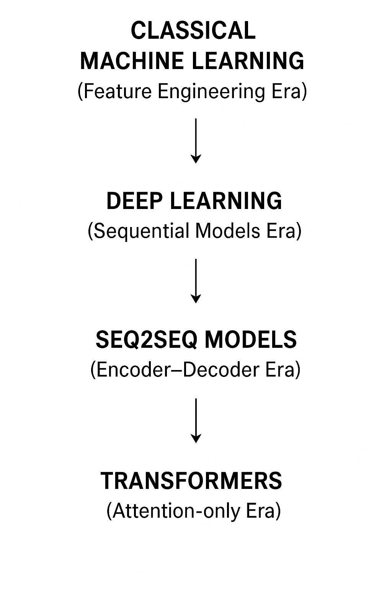

## NLP Projects

## 📖 Evolution of NLP Approaches

---

### 1️⃣ Classical Machine Learning (Feature Engineering Era)

**Goal**: Represent text numerically and apply ML models.  

**Techniques**:  
- **OHE (One Hot Encoding)** – sparse, no meaning between words.  
- **BoW (Bag of Words)** – counts word frequencies, loses order.  
- **TF-IDF** – weighted counts (rarer words get higher importance).  
- **Word2Vec / GloVe** – word embeddings capturing semantic meaning (e.g., king – man + woman ≈ queen).  

⚠️ **Limitation**: These are **context-independent embeddings** (same word = same vector, regardless of sentence).  

---

### 2️⃣ Deep Learning (Sequential Models Era)

Introduced **neural networks for sequences** to capture context.  

- **Simple RNN** – learns short dependencies, but vanishing gradient → can’t capture long context.  
- **LSTM** – solves long-term memory with gates.  
- **GRU** – simplified LSTM, fewer gates, faster.  
- **Bi-directional RNN** – looks at both past and future in the sequence.  

⚠️ **Limitation**: **Sequential processing** → slow training, struggles with very long sequences.  

---

### 3️⃣ Seq2Seq Models (Encoder–Decoder Era)

#### 🔹 Vanilla Encoder–Decoder (Seq2Seq)  
- Encoder compresses input into a single **context vector**.  
- Decoder generates output step by step.  
- 🚨 **Issue**: Bottleneck → long sentences lose information.  

#### 🔹 Seq2Seq with Attention  
- Decoder attends to **all encoder hidden states** instead of just context vector.  
- Dynamically computes a **context vector per step**.  
- ✅ Huge improvement in **translation, summarization**.  

---

### 4️⃣ Transformers (Attention-only Era)

- Introduced in **“Attention Is All You Need” (2017)**.  
- **Key Idea**: Drop recurrence → use only **self-attention**.  

**Advantages**:  
- Parallelizable (**fast training**).  
- Captures **long-range dependencies** better.  
- Stacks multiple layers of **self-attention + feedforward blocks**.  

**Variants**:  
- **BERT** → encoder-only (understanding tasks like classification, QA).  
- **GPT** → decoder-only (generation tasks).  
- **T5 / BART** → encoder–decoder (translation, summarization).  

⚡ Today, **Transformers dominate NLP** (translation, chatbots, summarization, coding assistants, etc.).  

---

### ✅ Final Evolution Path
**ML features → RNNs → Seq2Seq → Attention-enhanced Seq2Seq → Transformers**

## Let's Connect 

